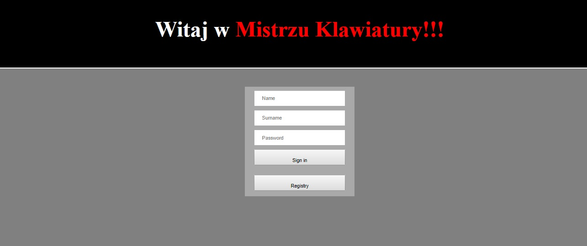
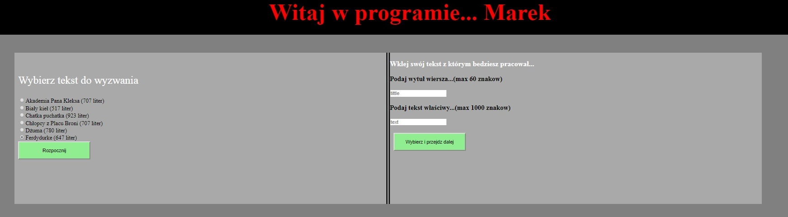
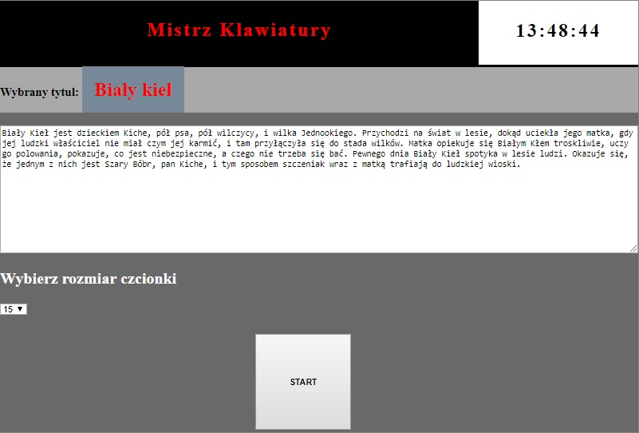
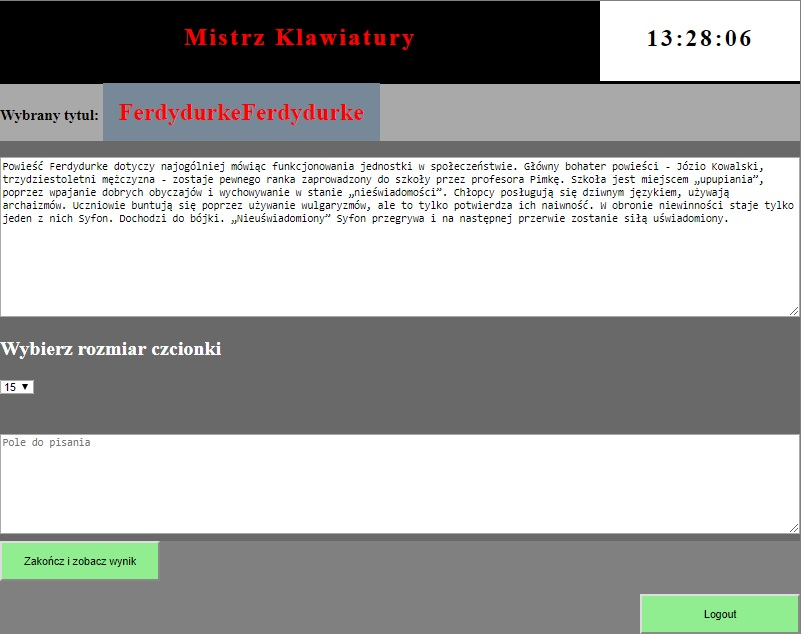
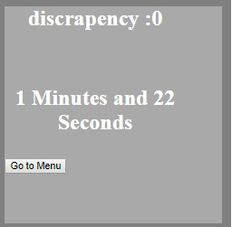

PROJECT NAME
#MistrzKlawiatury

DESCRIPTION
Project for learning to typed. User is able to insert his own text and
typed it. After finish there is a possibility to see discrepancies.

USAGE
Application starts with localhost:8080 where login page will start automaticly.
Two options for user:
-log in already existed account
-create new one.

After succesful log in user is able to start with automaticly prepared letters or prepare to work his own text.

After user decision will open page with timer, and text prepared to work.
Optionality font size may be changed by choosing appropriate value.

By press start button finish button and type area will be displayed. Hidden timer will start automaticly.

Zakoncz i zobacz wynik button will show summary page with scores

